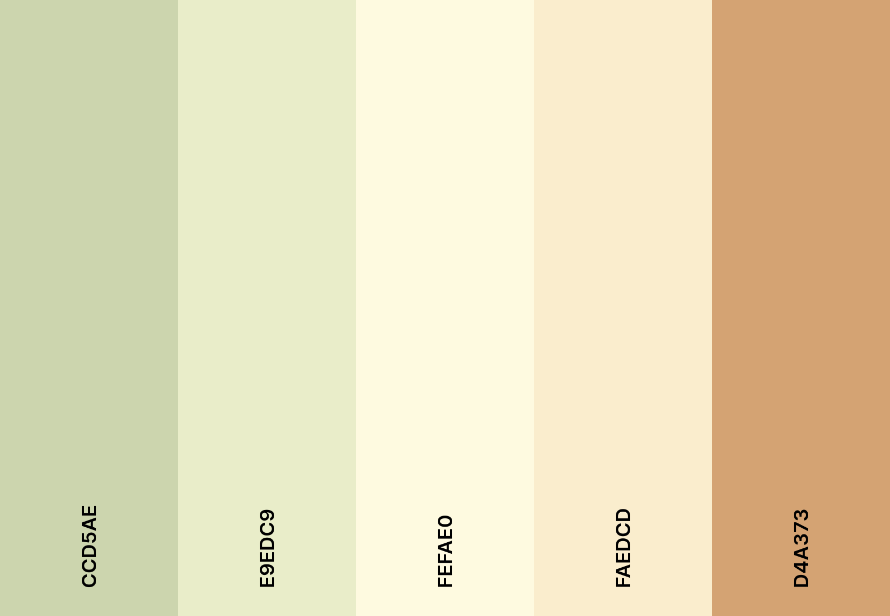

# Design System
This document outlines the design system for the project.

## Fonts
- **Primary Font:** Poppins

## Colours
- **Tea Green:** `#ccd5aeff`
- **Beige:** `#e9edc9ff`
- **Cornsilk:** `#fefae0ff`
- **Papaya Whip:** `#faedcdff`
- **Buff:** `#d4a373ff`

## Header
The Staff and Patient page have a Welcome Message displayed in the top left.

## Sign Out
At the top right of the Staff and Patient page is the `Sign Out` button.
